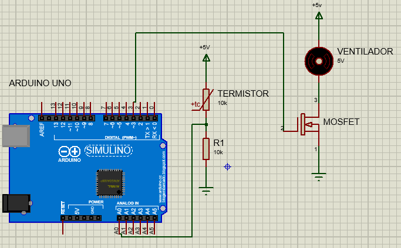
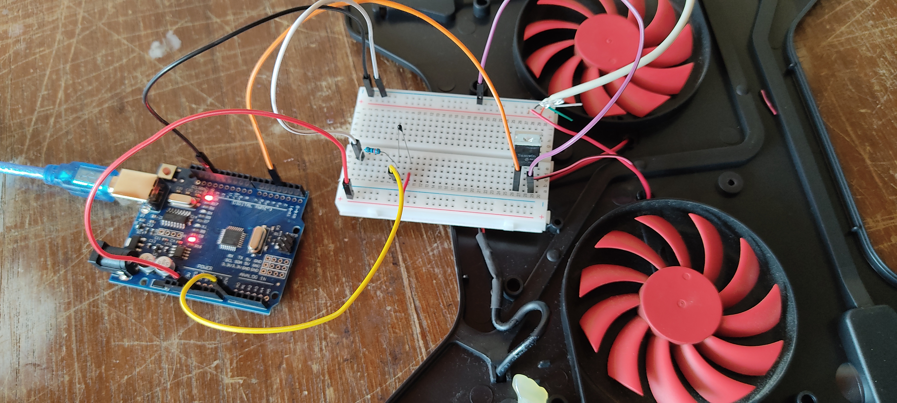

# Velocidad-de-Ventilador-Controlada-por-Temperatura
Control de la velocidad de un ventilador por temperatura con Arduino UNO.

**🎬 Demostración: [Video](https://www.youtube.com/watch?v=LNJPHR0Pbnc)**

## ⚡ Componentes
- Arduino UNO
- Termistor de 10K
- MOSFET SW50N06 canal n
- Resistor de 10K
- Ventilador de 5V/360mA

## 📐 Esquemático

## 📷 Montaje en protoboard

